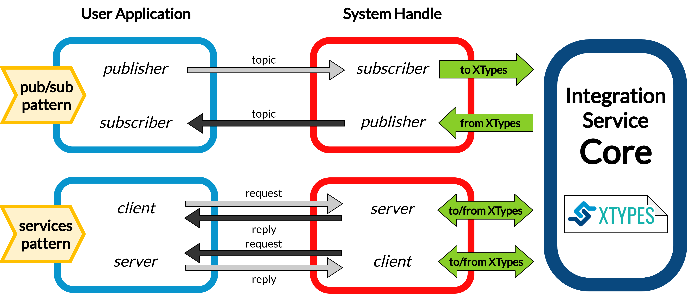
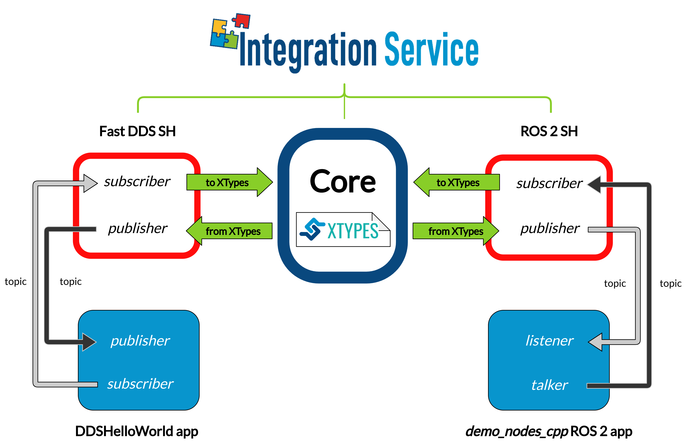

<a href="http://www.eprosima.com"></a>

# Fast DDS System Handle

## Introduction
[](https://github.com/eProsima/FastDDS-SH/actions)

A [System Handle](<!--TODO: add link-->) is a plugin that allows a certain middleware
or communication protocol to speak the same language used by the [eProsima Integration Service](https://github.com/eProsima/Integration-Service),
that is, *Extensible and Dynamic Topic Types for DDS* (**xTypes**);
specifically, the *Integration Service* bases its intercommunication abilities on eProsima's open source
implementation for the *xTypes* protocol, that is, [eProsima xTypes](https://github.com/eProsima/xtypes).



This repository contains the source code of the *Integration Service* **System Handle**
for eProsima's open source implementation of the [DDS](https://www.omg.org/omg-dds-portal/) protocol,
that is, [Fast DDS](https://github.com/eProsima/Fast-DDS).

This *System Handle* can be used for three main purposes:

* Connection between a *DDS* application and an application running over a different middleware implementation.
  This is the classic usage approach for the *Integration Service*.

* Connecting two *DDS* applications running under different Domain IDs.

* Creating a *TCP tunnel*, by means of running an *Integration Service* instance on each of the
  machines we want to establish a communication between.

## Configuration

The *Integration Service* is configured by means of a YAML configuration file, which specifies
the middlewares, topics and/or services involved in the intercommunication process; as well as
their topic/service type and the data exchange flow. This configuration file is loaded during
runtime, so there is no need to recompile any package before switching to a whole new
intercommunication architecture.

To get a more precise idea on how these YAML files are written and which files do they require
in order to succesfully configure and launch the *Integration Service*, please refer to the
dedicated [configuration](<!-- TODO: add link -->) section of the official documentation.
An illustrative explanation is also presented in the *Readme* `Configuration` section of the
[general project repository](https://github.com/eProsima/Integration-Service).

Regarding the *Fast DDS System Handle*, there are several specific parameters which can be configured
for the DDS middleware. All of these parameters are optional, and fall as suboptions of the main
five sections described in the *Configuration* chapter of the *Integration Service* repository:

* `systems`: The system `type` must be `fastdds`. In addition to the `type` and `types-from` fields,
  the *Fast DDS System Handle*.

  ```yaml
  systems:
    dds:
      type: fastdds
      participant:
        domain_id: 3
        file_path: <path_to_xml_profiles_file>.xml
        profile_name: fastdds-sh-participant-profile
  ```

   This section accepts the following specific configuration fields for the *Fast DDS System Handle*:

  * `participant`: Allows to add specific configuration for the [Fast DDS DomainParticipant](https://fast-dds.docs.eprosima.com/en/latest/fastdds/dds_layer/domain/domainParticipant/domainParticipant.html):

    * `domain_id`: Provides with an easy way to change the *Domain ID* of the DDS entities created
      by the *Fast DDS System Handle*.

    * `file_path`: Path to an XML file, containing a configuration profile for the System Handle
      participant. More information about Fast DDS XML profiles and how to fully customize the
      properties of DDS entities through them is available [here](https://fast-dds.docs.eprosima.com/en/latest/fastdds/xml_configuration/xml_configuration.html).

    * `profile_name`: Within the provided XML file, the name of the XML profile associated to the
      *Integration Service Fast DDS System Handle* participant.

## Examples

There are several *Integration Service* examples using the *Fast DDS System Handle* available
in the project's [main source code repository]([https://](https://github.com/eProsima/Integration-Service/tree/main/examples)).

Some of these examples, where the *Fast DDS System Handle* plays a different role in each of them, are introduced here.

### Publisher/subscriber intercommunication between Fast DDS and ROS 2

The configuration file for this example can be found
[here](https://github.com/eProsima/Integration-Service/blob/main/examples/basic/fastdds_ros2__helloworld.yaml).

Below, a high level diagram is presented, showing which entities will *Integration Service* create
to transmit data coming from a Fast DDS publisher into the ROS 2 data space, so that it can be
consumed by a ROS 2 subscriber on the same topic; and viceversa:



For a detailed step by step guide on how to build and test this example, please refer to the
[official documentation](<!-- TODO: link to example -->).

<!-- TODO: add YAML and applications for DDS and ROS2 to test this
### Fast DDS service server addressing petitions coming from a ROS 2 service client

The configuration file for this example can be found
[here](TODO).

Below, a high level diagram is presented, showing which entities will *Integration Service* create
to forward the petitions requested from a ROS 2 client application to a DDS service server application,
which will process them and produce a reply message which will be transmited back to the ROS 2 client:


For a detailed step by step guide on how to build and test this example, please refer to the
[official documentation](TODO: link).
-->

<!-- TODO: add YAML and basic DDS applications using different domain IDs.
An even better option would be to modify the existing DDShelloworld to accept a different domain ID from the
console options
### Bridging communication between two DDS data spaces under different Domain IDs

The configuration file for this example can be found
[here](TODO).

Below, a high level diagram is presented, showing which entities will *Integration Service* create
to forward the messages sent from a DDS publisher hosted on a participant with domain ID **2** to
a subscriber created under domain ID **4**:


For a detailed step by step guide on how to build and test this example, please refer to the
[official documentation](TODO: link).
-->

### Using Fast DDS TCP WAN tunneling to communicate two applications running on different networks

The configuration files for this example can be found
[here](https://github.com/eProsima/Integration-Service/tree/main/examples/wan_tunneling).

Below, a high level diagram is presented, showing which entities will *Integration Service* create
to forward the messages coming from a ROS 2 node running on a certain machine to another ROS 2
node running on another machine, which are connected to two separate WAN networks:


For a detailed step by step guide on how to build and test this example, please refer to the
[official documentation](<!-- TODO: link to example -->).

## Compilation flags

Besides the [global compilation flags](<!-- TODO: link to IS readme section-->) available for the
whole *Integration Service* product suite, there are some specific flags which apply only to the
*Fast DDS System Handle*; they are listed below:

* `BUILD_FASTDDS_TESTS`: Allows to specifically compile the *Fast DDS System Handle* unitary and
  integration tests; this is useful to avoid compiling each *System Handle's* test suite present
  in the `colcon` workspace, which is what would happen if using the `BUILD_TESTS` flag; and thus,
  minimizing the building time; to use it, prior to making sure that the *Fast DDS System Handle*
  is present in the `colcon` workspace, the following command must be executed:
  ```bash
  ~/is_ws$ colcon build --cmake-args -DBUILD_FASTDDS_TESTS=ON
  ```

<!-- TODO: complete when it is uploaded to read the docs
## API Reference
-->

## License

This repository is open-sourced under the *Apache-2.0* license. See the [LICENSE](LICENSE) file for more details.

# Getting help

If you need support you can reach us by mail at `support@eProsima.com` or by phone at `+34 91 804 34 48`.