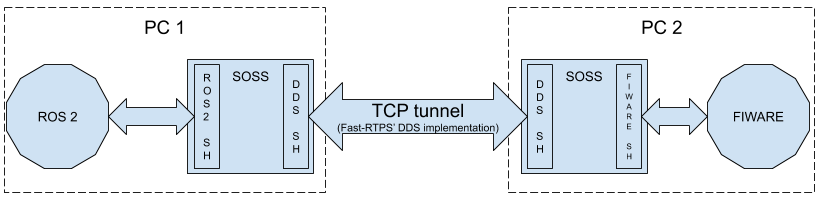

# soss-dds

System handle to connect [*SOSS*][soss] to *eProsima*'s open-source implementation of the [DDS protocol][dds], [Fast-RTPS][fast].

## Installation
To install this package into a workspace already containing SOSS, just clone this repository into the sources directory and build it:
    ```
    git clone git@github.com:eProsima/SOSS-DDS.git
    (in the root of the workspace) colcon build --packages-up-to soss-dds
    ```

## Use case - Connecting with ROS2

1. [Create a colcon workspace](https://index.ros.org/doc/ros2/Tutorials/Colcon-Tutorial/#create-a-workspace).
2. Clone the soss project into the source subfolder.
    ```
    git clone git@github.com:osrf/soss_v2.git
    ```

3. Clone this project into the subfolder.
    ```
    git clone git@github.com:eProsima/SOSS-DDS.git
    ```

    The workspace layout should look like this:
    ```
        soss_wp
        └── src 
            ├── soss
            │   └── ... (other soss project subfolders)
            │   └── packages
            │       └── soss-ros2 (ROS2 system handle)
            └── soss-dds (repo)
                    ├── dds (soss-dds colcon pkg)
                    └── dds-test (soss-dds-test colcon pkg)
    ```

5. Source a colcon environment in which ROS2 has been built (soss-ros2 uses rclcpp package).
    ```
    source path/to/ros2/ws/install/local_setup.bash
    ```

6. In the workspace folder, execute colcon:
    ```
    colcon build --packages-up-to soss-dds soss-ros2
    ```
7. Source the current environment
    ```
    source install/local_setup.bash
    ```

## Usage

This system handle is mainly used to connect any system with the DDS protocol.

Also, it can be used to create a TCP tunnel connecting two SOSS instances. That way, a user can connect two ROS2 systems through TCP, or connect any system supported by soss with other system that is not in its LAN.

For the TCP tunnel, two instances of SOSS are going to be used, one in each of the computers that are going to be communicated. Each of those instances will have a system handle for the system they want to communicate in the WAN network, and other to communicate with Fast-RTPS' DDS implementation. 

If we take as an example the communication between ROS2 and FIWARE, the communication scheme will look like this:



### Configuration

SOSS must be configured with a YAML file, which tells the program everything it needs to know in order to establish the connection between two or more systems that the user wants. 
For example, if a simple string message wants to be exchanged between two ROS2 systems through a TCP tunnel, the configuration files for the two different SOSS instances that that tunnel must have should look as follows.

```YAML
systems:
    dds:
      type: dds
      dynamic types:
        struct std_msgs__String: # This name can't have any '/', as explained later on this section.
          string: "data"
      participant:
        file_path: "~/soss_wp/install/soss-dds/sample/tcp/config.xml"
        profile_name: soss_profile_client

    ros2:
      type: ros2

routes:
    ros2_to_dds: { from: ros2, to: dds }
    dds_to_ros2: { from: dds, to: ros2 }

topics:
    hello_ros2: { type: "std_msgs/String", route: dds_to_ros2 }
    hello_fiware: { type: "std_msgs/String", route: ros2_to_dds }
```

To see how general SOSS systems, users and topics are configured, please refer to SOSS' documentation.

For the DDS system handle, the user must give two extra YAML maps which are “dynamic types” and “participant”, as seen above.

On one hand, the dynamic types map tells the DDS system handle how a certain type is mapped. This is necessary to convert the type from a soss message, which is the type used inside soss, to a dynamic type, which is the type used in DDS. This conversion is done dynamically at runtime.

To have a guide on how dynamic types are defined in YAML files, see the [YAML dynamic types](#yaml-dynamic-types) section.

The dynamic types standard does not allow certain characters in its names. For this reason, if a type defined in the topics section of the configuration file has in its name a `/`, the dds system handle will map that character into two underscores. That's why the type inside the dynamic types map is std_msgs__String, while the type inside the topics section is std_msgs/String. This is something important to notice when connecting to ROS2, because in ROS2 most of the types have a `/` in their names. Also, notice that in DDS the type will be published with two underscores.

On the other hand, `participant` map tells the dds system handle where it can find the configuration file for the DDS profle, and what profile must be used from the many that can be defined in that XML. This profile is used to set the DDS quality of services' parameters. A guide on how this XML files are configured can be found in [Fast-RTPS' documentation](https://fast-rtps.docs.eprosima.com/en/v1.7.2/xmlprofiles.html). An example of an XML configuration file can be found [in this repository](dds/sample/tcp/config.xml). Notice that this example file has two participant profiles defined in it, one to be used in the client side and other for the server side, so the YAML file used to configure SOSS in the server computer must change the profile_name in the example above from "soss_profile_client" to "soss_profile_server".

The `participant` map is optional, and if it is not given, the dds system handle will create a default UDP profile.

### YAML dynamic types

*eProsima*'s *dtparser* can create dynamic types from a YAML map, allowing the user to define new dynamic types for each run without the need of rebuilding the project.

Dynamic types are defined in the YAML map as follows:

```YAML
type name:
    member_1_type: "member_1_name"
    member_2_type: "member_2_name"
```

The main 'type' for the general dynamic type must be a struct, as soss messages are defined as structures. 

The name for each type can be whatever the user wants, with the two following rules:

1. The name can not have spaces in it.
1. The name must be formed only by letters, numbers and underscores. Remember that the system handle will map each `/` for `__`, as mentioned in the configuration section, to allow an easy connection with ROS2 types.

Each of the members of the dynamic type can have its own type and name. Each member is defined just by its type and name, such as `int32: "my_integer"`.

*eProsima*'s *dtparser* supports the following basic types:

- boolean
- char8
- char16
- byte
- int16
- int32
- int64
- uint16
- uint32
- uint64
- float32
- float64
- float128
- string

The dynamic types parser also allow nested structures. To create a nested structure, there must be a definition of the basic structure and a reference to the basic structure in the member of the nested structure, using the name of the simple structure. 

The following is an example of a full configuration file that uses the ROS2 nested type std_msgs/Header:

```YAML
systems:
    dds:
      type: dds
      dynamic types:
        struct stamp: 
          int32: "sec"
          uint32: "nanosec"
        struct std_msgs__Header:
          string: "frame_id"
          stamp: "stamp"

    ros2: 
      type: ros2

routes:
    ros2_to_dds: { from: ros2, to: dds }
    dds_to_ros2: { from: dds, to: ros2 }

topics:
    hello_dds:
      type: "std_msgs/Header"
      route: ros2_to_dds
    hello_ros2:
      type: "std_msgs/Header"
      route: dds_to_ros2
```

Notice how in the definition of the dynamic types, the structure "stamp" is used as a member in the structure "std_msgs__Header", and is defined just before the nested structure. The order is not actually important, so the type "stamp" could have been defined after "std_msgs__Header".

### Connect DDS with ROS2

0. Source the soss environment (as in the installation step)
1. Run soss (with the sample configuration): `soss src/dds/dds/sample/tcp/hello_dds_ros2.yaml`

- Also, you can have a look to the [internal design](dds/doc/design.md)
- For a fast usage, you can use the [dockerfile](Dockerfile)

## Changelog

### v0.1.0

- DDS communication in both directions based on topic
- TCP tunnel support
- Integration tests

 [fast]: https://github.com/eProsima/Fast-RTPS
 [soss]: https://github.com/osrf/soss
 [dds]: https://en.wikipedia.org/wiki/Data_Distribution_Service
 