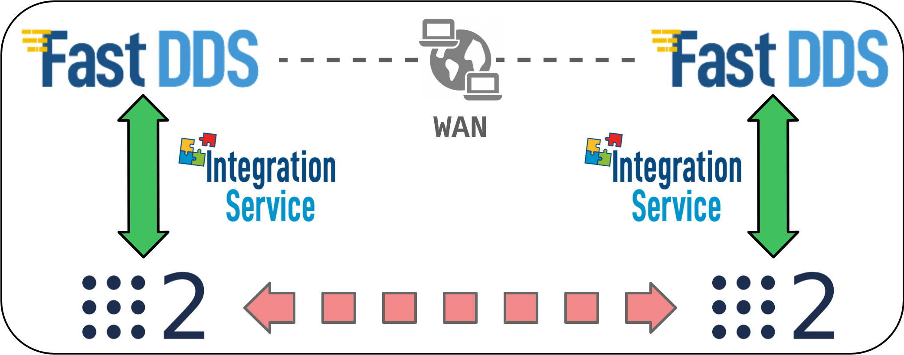

<a href="https://integration-service.docs.eprosima.com/"></a>

# Fast DDS System Handle

[](https://github.com/eProsima/FastDDS-SH/actions)

## Introduction

### What is a System Handle?

A [System Handle](https://integration-service.docs.eprosima.com/en/latest/user_manual/systemhandle/sh.html) is a plugin that allows a certain middleware
or communication protocol to speak the same language used by the [eProsima Integration Service](https://github.com/eProsima/Integration-Service),
that is, *Extensible and Dynamic Topic Types for DDS* (**xTypes**);
specifically, *Integration Service* bases its intercommunication abilities on eProsima's open source
implementation for the *xTypes* protocol, that is, [eProsima xTypes](https://github.com/eProsima/xtypes).

<p align="center">
  <a href="https://integration-service.docs.eprosima.com/en/latest/user_manual/systemhandle/sh.html"></a>
</p>

### The Fast DDS SystemHandle

<a href="https://fast-dds.docs.eprosima.com/"></a>

This repository contains the source code of the *Integration Service* **System Handle**
for eProsima's open source implementation of the [DDS](https://www.dds-foundation.org/omg-dds-standard/) protocol,
that is, [Fast DDS](https://github.com/eProsima/Fast-DDS).

This *System Handle* can be used for three main purposes:


1. Connection between a *DDS* application and an application running over a different middleware implementation.
  This is the classic use-case approach for *Integration Service*.

1. Connecting two *DDS* applications running under different Domain IDs.

1. Creating a *TCP tunnel*, by running an *Integration Service* instance on each of the
  machines you want to establish a communication between.
  
## Dependencies

This section provides a list of the dependencies needed in order to compile *FastDDS System Handle*. 

* [FastDDS](https://github.com/eProsima/Fast-DDS#installation-guide): eProsima C++ implementation for *DDS*.

## Configuration

*Integration Service* is configured by means of a YAML configuration file, which specifies
the middlewares, topics and/or services involved in the intercommunication process, as well as
their topic/service types and the data exchange flow. This configuration file is loaded at
runtime, so there is no need to recompile any package before switching to a whole new
intercommunication architecture.

To get a more precise idea on how these YAML files have to be filled and which fields they require
in order to succesfully configure and launch an *Integration Service* project, please refer to the
[dedicated configuration section](https://integration-service.docs.eprosima.com/en/latest/user_manual/yaml_config.html) of the official documentation.

Regarding the *Fast DDS System Handle*, there are several specific parameters which can be configured
for the DDS middleware. All of these parameters are optional, and fall as suboptions of the main
five sections described in the *Configuration* chapter of the *Integration Service* repository:

* `systems`: The system `type` must be `fastdds`. In addition to the `type` and `types-from` fields,
  the *Fast DDS System Handle* accepts the following specific configuration fields:

  ```yaml
  systems:
    dds:
      type: fastdds
      participant:
        domain_id: 3
        file_path: <path_to_xml_profiles_file>.xml
        profile_name: fastdds-sh-participant-profile
  ```

  * `participant`: Allows to add specific configuration for the [Fast DDS DomainParticipant](https://fast-dds.docs.eprosima.com/en/latest/fastdds/dds_layer/domain/domainParticipant/domainParticipant.html):

    * `domain_id`: Provides an easy way to change the *Domain ID* of the DDS entities created
      by the *Fast DDS System Handle*.

    * `file_path`: Path to an XML file, containing a configuration profile for the System Handle
      participant. More information about Fast DDS XML profiles and how to fully customize the
      properties of DDS entities through them is available [here](https://fast-dds.docs.eprosima.com/en/latest/fastdds/xml_configuration/xml_configuration.html).

    * `profile_name`: Within the provided XML file, the name of the XML profile associated to the
      *Integration Service Fast DDS System Handle* participant.

## Examples

There are several *Integration Service* examples using the *Fast DDS System Handle* available
in the project's [main source code repository](https://github.com/eProsima/Integration-Service/tree/main/examples).

Some of these examples, where the *Fast DDS System Handle* plays a different role in each of them, are introduced here.

<a href="https://integration-service.docs.eprosima.com/en/latest/examples/different_protocols/pubsub/dds-ros2.html"></a>

### DDS - ROS 2 bridge  (publisher - subscriber)

In this example, *Integration Service* uses both this *Fast DDS System Handle* and the *ROS 2 System Handle*
to transmit data coming from a Fast DDS publisher into the ROS 2 data space, so that it can be
consumed by a ROS 2 subscriber on the same topic, and viceversa.

<p align="center">
  <a href="https://integration-service.docs.eprosima.com/en/latest/examples/different_protocols/pubsub/dds-ros2.html"></a>
</p>

The configuration file used by *Integration Service* for this example can be found
[here](https://github.com/eProsima/Integration-Service/blob/main/examples/basic/fastdds_ros2__helloworld.yaml).

For a detailed step by step guide on how to build and test this example, please refer to the
[dedicated section](https://integration-service.docs.eprosima.com/en/latest/examples/different_protocols/pubsub/dds-ros2.html) in the official documentation.

<a href="https://integration-service.docs.eprosima.com/en/latest/examples/different_protocols/services/dds-server.html"></a>

### DDS service server

In this example, the *Fast DDS System Handle* tackles the task of bridging a DDS server with one or more client applications,
playing the role of a service server capable of processing incoming requests from several middlewares (*ROS1*, *ROS2*,
*WebSocket*) and producing an appropriate answer for them.

<p align="center">
  <a href="https://integration-service.docs.eprosima.com/en/latest/examples/different_protocols/services/dds-server.html"></a>
</p>

The configuration file used by *Integration Service* for this example can be found
[here](https://github.com/eProsima/Integration-Service/blob/main/examples/basic/fastdds_server__addtwoints.yaml).

For a detailed step by step guide on how to build and test this example, please refer to the
[dedicated section](https://integration-service.docs.eprosima.com/en/latest/examples/different_protocols/services/dds-server.html) in the official documentation.

<a href="https://integration-service.docs.eprosima.com/en/latest/examples/same_protocol/dds_change_domain.html"></a>

### DDS Domain ID change

In this example, *Integration Service* uses the *Fast DDS System Handle*
to forward the messages sent from a DDS publisher hosted on a participant with domain ID **5** to
a subscriber created under domain ID **3**.

<p align="center">
  <a href="https://integration-service.docs.eprosima.com/en/latest/examples/same_protocol/dds_change_domain.html"></a>
</p>

The configuration file for this example can be found
[here](https://github.com/eProsima/Integration-Service/blob/main/examples/basic/fastdds__domain_id_change.yaml).

For a detailed step by step guide on how to build and test this example, please refer to the
[dedicated section](https://integration-service.docs.eprosima.com/en/latest/examples/same_protocol/dds_change_domain.html) in the official documentation.

<a href="https://integration-service.docs.eprosima.com/en/latest/examples/wan_communication/wan_tcp_dds.html"></a>

### WAN-TCP tunneling over DDS

The last example depicts how *Integration Service*, along with the *Fast DDS System Handle*, could be useful
to forward the messages coming from a ROS 2 node running on a certain machine to another ROS 2
node running on another machine, which are connected to two separate WAN networks, thanks to the
WAN capabilities of *Fast DDS*.

<p align="center">
  <a href="https://integration-service.docs.eprosima.com/en/latest/examples/wan_communication/wan_tcp_dds.html"></a>
</p>

The configuration files for this example can be found
[here](https://github.com/eProsima/Integration-Service/tree/main/examples/wan_tunneling/ros2__wan_helloworld).

For a detailed step by step guide on how to build and test this example, please refer to the
[dedicated section](https://integration-service.docs.eprosima.com/en/latest/examples/wan_communication/wan_tcp_dds.html) in the official documentation.

## Compilation flags

Besides the [global compilation flags](https://integration-service.docs.eprosima.com/en/latest/installation_manual/installation.html#global-compilation-flags) available for the
whole *Integration Service* product suite, there are some specific flags which apply only to the
*Fast DDS System Handle*; they are listed below:

* `BUILD_FASTDDS_TESTS`: Allows to specifically compile the *Fast DDS System Handle* unitary and
  integration tests; this is useful to avoid compiling each *System Handle's* test suite present
  in the `colcon` workspace, which is what would happen if using the `BUILD_TESTS` flag; and thus,
  minimizing the building time; to use it,after making sure that the *Fast DDS System Handle*
  is present in the `colcon` workspace, the following command must be executed:
  ```bash
  ~/is_ws$ colcon build --cmake-args -DBUILD_FASTDDS_TESTS=ON
  ```

## Documentation

The official documentation for the *Fast DDS System Handle* is included within the official *Integration Service*
documentation, hosted by [Read the Docs](https://integration-service.docs.eprosima.com/), and comprises the following sections:

* [Installation Manual](https://integration-service.docs.eprosima.com/en/latest/installation_manual/installation_manual.html)
* [User Manual](https://integration-service.docs.eprosima.com/en/latest/user_manual/systemhandle/fastdds_sh.html)
* [API Reference](https://integration-service.docs.eprosima.com/en/latest/api_reference/fastdds_sh/api_is_fastdds_sh.html)

## License

This repository is open-sourced under the *Apache-2.0* license. See the [LICENSE](LICENSE) file for more details.

## Getting help

If you need support you can reach us by mail at `support@eProsima.com` or by phone at `+34 91 804 34 48`.
