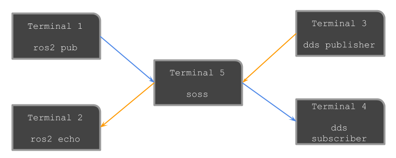

# Tutorial
This tutorial intends to setup an entire dds and ros2 communication environment from zero.
To achieve this, we need to deploy a `dds` world and a `ros2` world that will be connected thanks to `soss`.

## Prerequisites
### Ros2
Any version of `ros2` (either `crystal`, `dashing`, or `eloquent`) is valid for the purpose of this tutorial.

To install it, you can take a look to the
[official documentation](https://index.ros.org/doc/ros2/Installation/Eloquent/Linux-Install-Binary/).

In order to test it (supposing eloquent), please open two terminals and do the following:
- First terminal:
  ```
  source ~/ros2_eloquent/install/setup.bash
  ros2 run demo_nodes_cpp talker
  ```
- Second terminal:
  ```
  source ~/ros2_eloquent/install/setup.bash
  ros2 run demo_nodes_cpp listener
  ```
If the listener receives messages, congratulations!, `ros2` has been installed succesfully.

### DDS
As a `dds` middleware we will use the `fastrtps` implementation (the default `ros2` middleware implementation).
To install it, you can use the official documentation [here](https://fast-rtps.docs.eprosima.com/en/latest/sources.html).

Also, we will need `fastrpts-gen` to generate our types.
To install it, clone the repo with the `--recursive` option:
```
git clone https://github.com/eProsima/Fast-RTPS-Gen.git --recursive
cd Fast-RTPS-Gen
gradle assemble
```
Note that `Fast-RTPS-Gen` is a Java application. You need to have installed `Java 8` and `Gradle`.
Once you have `Fast-RTPS-Gen` installed you can execute it from the script found at `scripts/fastrptsgen`.
We strongly recommend to add this `scripts` folder to the path in order to execute the script easily from everywhere.

In order to test your `dds` installation you can follow the steps found
[here](https://fast-rtps.docs.eprosima.com/en/latest/introduction.html).

You need to be able to create and connect a publisher and a subscriber.

Note: for the purpose of this tutorial, when generating code with `Fast-RTPS-Gen`, add the `-example` flag
to get a functional publisher and subscriber for the generated type.

### SOSS
To use soss, you need to create a _colcon workspace_ with the packages you want to use.
Four our purpose, we need to add two repositories to our workspace:
- `https://github.com/osrf/soss` that offers the soss core and ros2 system handle.
- `https://github.com/eProsima/soss-dds` that offers the dds system handle.
Both repositories must be placed into the `src` folder of our _colcon workspace_.

Before compiling it with colcon, we need to _source_ the ros2 environment as follows (supposing eloquent and linux):
```
source ~/ros2_eloquent/install/setup.bash
```
This is needed to fetch all tools and dependencies from `ros2` in order to compile the _ros2 system handle_.
Then we can compile by simply writing the following command from our colcon workspace:
```
colcon build
```

## DDS-ROS2 use case
In our use case we want communicate a ros2 world that is using the `std_msgs/String` type,
with a dds world that is using a type defined in the `HelloWorld.idl` file found in the _fastrtps getting started_.

Both types have a `string` member, so they are compatible.
The type name and the member name are different but it does not matter because soss will take care of it
(see the [xtypes QoS policies for consistency between types](https://github.com/eProsima/xtypes#type-consistency-qos-policies) for more information).

`soss` executable receives a [yaml file](https://github.com/osrf/soss/blob/master/doc/concept.md) as a configuration file for the communications.
You can see `soss` as a router that enables different communications among several middlewares.

In this case the yaml file we want is the following:
```
types:
    idls:
        - >
            struct HelloWorld
            {
                string msg;
            };
systems:
    dds: { type: dds }
    ros2: { type: ros2 }

routes:
    ros2_to_dds: { from: ros2, to: dds }
    dds_to_ros2: { from: dds, to: ros2 }

topics:
    hello_ros2: { type: "std_msgs/String", route: dds_to_ros2, remap: { dds: { type: HelloWorld } } }
    hello_dds: { type: "std_msgs/String", route: ros2_to_dds, remap: { dds: { type: HelloWorld } } }

```

You can find this yaml file here: [`dds_ros2_string.yaml`](examples/udp/dds_ros2_string.yaml)

### Configure `Fast-RTPS` publisher and subscriber
The previously generated example of Fast-RTPS communicates the dds world publisher and subscriber between them.
Here we do not want this behavior, and we want instead to publish from `dds` into `ros2` and to subscribe to `dds` from `ros2`.
To achieve this, we need to modify the topic names of both the publisher and subscriber `.cxx` example files.

#### `HelloWorldPublisher.cxx`
Search the line containing the `topicName` of the publisher
```c++
Wparam.topic.topicName = "HelloWorldPubSubTopic";
```
and modify it with a different topic name, for instance the following:
```c++
Wparam.topic.topicName = "hello_ros2";
```

Also, we can modify the content of the empty message that the publisher is currently sending.
Search the following code in `run()` function:
```c++
// Publication code
HelloWorld st;
```
and add the following line:
```c++
st.msg("This is a message from dds to ros2");
```

#### `HelloWorldSubscriber.cxx`
Analogously to the above publisher modification, search the `topicName` line of the subscriber
```c++
Wparam.topic.topicName = "HelloWorldPubSubTopic";
```
and modify it with a different topic name, for instance the following:
```c++
Wparam.topic.topicName = "hello_dds";
```

Once the files have been modified, we need to compile them.
Simply, write `make` in your build folder.

If we now run the dds world publisher and subscriber, they will not match between them.


### Deploy
To deploy the system we will need 5 terminals at the same time:


#### Terminal 1
To publish the topic from ros2, we only need to write the following commands:
```
source ~/ros2_eloquent/install/setup.bash
ros2 topic pub /hello_dds std_msgs/String "{\"This is a message from ros2 to dds\"}"
```

#### Terminal 2
Similarly to what we did to publish from ros2, for subscribing we need to write:
```
source ~/ros2_eloquent/install/setup.bash
ros2 topic echo /hello_ros std_msgs/String
```

#### Terminal 3
Placed into the build folder where you have generated the HelloWorld publisher and subscriber, run the dds publisher
```
./HelloWorld publisher
```

#### Terminal 4
As in terminal 3, run the dds subscriber:
```
./HelloWorld subscriber
```

#### Terminal 5
All matchings are made before running soss.
Placed into the `soss` workspace, source both ros2 and your soss installation, and run the `soss` executable with the previous yaml.

```
source ~/ros2_eloquent/install/setup.bash
source install/setup.bash
soss src/soss-dds/examples/udp/dds_ros2_string.yaml
```

After that, both the `ros2` and the `dds` subscriber should receive messages from their corresponding publishers.
